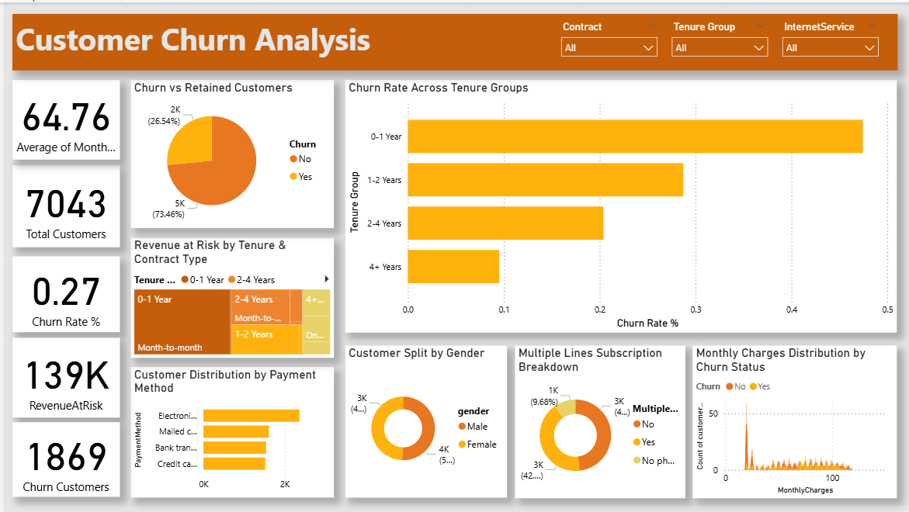

# 📞 Telco Customer Churn Analysis

> **Predicting customer churn before it happens — using Python, SQL, and Power BI**



---

## 📌 Problem Statement

A telecom company loses **~26.5% of customers annually**.  
Each lost customer = avg **$65/month × ~18 months = ~$1,170 in lifetime value gone**.

The business question: **Can we predict who is about to leave — before they do?**

This project builds an end-to-end churn prediction pipeline covering exploratory data analysis, machine learning, SQL business queries, and an interactive Power BI dashboard.

---

## 📁 Repository Structure

```
Telco_Customer_Churn_Analysis/
│
├── data/                          # Raw and enriched datasets
├── images/                        # EDA plots and visual outputs
├── notebook/                      # Jupyter Notebook (EDA + ML)
├── sql/                           # SQL KPI query scripts
│
├── Dashboard.png                  # Power BI dashboard screenshot
├── Telco_Customer_Churn.pbix      # Power BI dashboard file
├── model_predictions...txt        # ML model prediction outputs
├── telco_enriched...txt           # Feature-engineered dataset
├── result1_Overall_churn_rate...txt
├── result2_Churn_rate_by_Contract_Type...txt
├── result3_Churn_rate_by_Internet_Service...txt
├── result4_Average monthly charge for churned vs retained...txt
├── result5_Churn by tenure bucket...txt
├── result6_High-value customers at risk...txt
└── README.md
```

---

## 🔍 Key Findings

| # | Insight | Value |
|---|---------|-------|
| 1 | Overall churn rate | **26.5%** |
| 2 | Month-to-month contract churn rate | **43%** — 14× higher than 2-year contracts |
| 3 | Fiber optic customer churn rate | **42%** — paying more, satisfied less |
| 4 | New customer churn rate (0–12 months) | **48%** — critical onboarding window |
| 5 | Highest-risk payment method | **Electronic check** users |
| 6 | Monthly revenue at risk | **$139K/month** |

---

## 🛠️ Tech Stack

| Tool | Usage |
|------|-------|
| **Python** | EDA, feature engineering, ML modeling |
| **pandas, numpy** | Data manipulation |
| **matplotlib, seaborn** | Data visualization |
| **scikit-learn** | Logistic Regression, Random Forest |
| **SQL (SQLite)** | Business KPI queries |
| **Power BI** | Interactive dashboard |

---

## 🐍 Phase 1 — Python (EDA + Machine Learning)

### Data Cleaning
- Fixed `TotalCharges` column stored as string (contained spaces for new customers)
- Filled null values post-conversion
- Confirmed **7,043 rows × 21 columns**

### Feature Engineering
| Feature | Description |
|---------|-------------|
| `Tenure_Group` | Bucketed tenure into lifecycle stages (New / Growing / Established / Loyal) |
| `ServiceCount` | Count of add-on services per customer |
| `HighValue` | Flag for customers with MonthlyCharges > $70 |
| `ChargeRatio` | Monthly-to-Total charge ratio |

### EDA Highlights
- Churn distribution across contract type, internet service, payment method, and tenure
- Box plots comparing MonthlyCharges and tenure between churned vs retained
- Correlation analysis to identify strongest churn drivers

### ML Models

| Model | Precision | Recall | F1-Score |
|-------|-----------|--------|----------|
| Logistic Regression | 0.79 | 0.80 | 0.79 |
| **Random Forest** | **0.82** | **0.81** | **0.81** |

- Used `class_weight='balanced'` to handle the 74/26 class imbalance
- Exported `model_predictions.csv` with churn probability scores for Power BI

---

## 🗄️ Phase 2 — SQL KPI Queries (SQLite)

6 business queries written to extract actionable insights:

```sql
-- 1. Overall churn rate
-- 2. Churn rate by Contract Type
-- 3. Churn rate by Internet Service
-- 4. Average monthly charge — churned vs retained
-- 5. Churn by tenure bucket (lifecycle analysis)
-- 6. High-value customers at risk (MonthlyCharges > $70)
```

All query results are saved as `.txt` files in the root directory.

---

## 📊 Phase 3 — Power BI Dashboard

### Visuals Used
| # | Visual | Purpose |
|---|--------|---------|
| 1 | **Donut Chart** | Total customers by churn status |
| 2 | **Bar Chart** | Churn Rate % by Tenure Group |
| 3 | **Treemap** | Revenue at Risk by Tenure Group & Contract |
| 4 | **Bar Chart** | Total Customers by Payment Method |
| 5 | **Donut Chart** | Customers by Gender |
| 6 | **Donut Chart** | Customers by Multiple Lines |
| 7 | **Histogram** | Customer count by Monthly Charges & Churn |

### KPI Cards
- Average Monthly Charges: **$64.76**
- Total Customers: **7,043**
- Churn Rate %: **0.27**
- Revenue at Risk: **$139K**
- Churn Customers: **1,869**

### Slicers
- Contract Type
- Internet Service
- Churn (Yes / No)

### DAX Measures
```dax
ChurnRate% = 
  DIVIDE(
    CALCULATE(COUNTROWS(telco_enriched), telco_enriched[Churn] = "Yes"),
    COUNTROWS(telco_enriched)
  ) * 100

RevenueAtRisk = 
  CALCULATE(
    SUM(telco_enriched[MonthlyCharges]),
    telco_enriched[Churn] = "Yes"
  )

TenureYearGroup = 
  SWITCH(TRUE(),
    telco_enriched[tenure] <= 12, "Year 1 (0–12 Months)",
    telco_enriched[tenure] <= 24, "Year 2 (13–24 Months)",
    telco_enriched[tenure] <= 36, "Year 3 (25–36 Months)",
    telco_enriched[tenure] <= 48, "Year 4 (37–48 Months)",
    telco_enriched[tenure] <= 60, "Year 5 (49–60 Months)",
    "Year 6+ (61–72 Months)"
  )
```

---

## 💡 Business Impact

> Targeting the **top 20% of at-risk customers** with a retention offer (e.g., $10/month discount on a contract upgrade) could prevent **~$83K/month in lost revenue** at a cost of under $14K in discounts — a **6× return on investment**.

---

## 📦 Dataset

- **Source:** [IBM Telco Customer Churn — Kaggle](https://www.kaggle.com/datasets/blastchar/telco-customer-churn)
- **Rows:** 7,043 customers
- **Columns:** 21 features (demographics, services, contract, billing)
- **Target Variable:** `Churn` (Yes / No)

---

## ▶️ How to Run

```bash
# 1. Clone the repository
git clone https://github.com/arshadhrs/Telco_Customer_Churn_Analysis.git

# 2. Install dependencies
pip install pandas numpy matplotlib seaborn scikit-learn

# 3. Run the notebook
jupyter notebook notebook/churn_analysis.ipynb

# 4. Open dashboard
# Open Telco_Customer_Churn.pbix in Power BI Desktop
```

---

## 👤 Author

**Arshad H**  
B.Com (Business Analytics) — St. Joseph's College, Trichy  
Aspiring Data Analyst | Python • SQL • Power BI  

[](https://www.linkedin.com/in/YOUR_LINKEDIN)
[](https://github.com/arshadhrs)

---

## 📄 License

This project is open source and available under the [MIT License](LICENSE).
